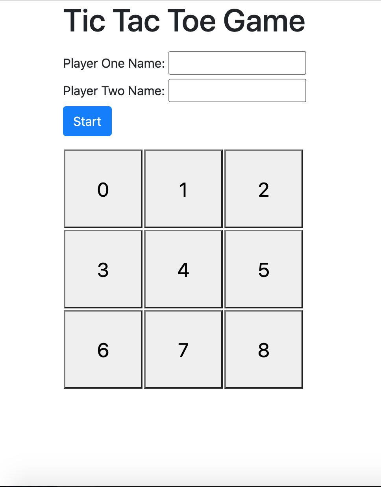

# TicTacToe Game

This is a simple javascript Tic Tac Toe game from the odin project where you can play in your browser.

## Built With

- JavaScript
- Html,
- Css
- Jest

[Live Demo Link](https://raw.githack.com/Samitti/Tic-Tac-Toe-Project/feature/index.html)

## Getting Started

## Install

- Install VSCode or any code editor you like
- Install Node JS

To get a local copy up and running follow these simple example steps.

- Open a terminal or command prompt interface on your machine
- Clone the project unto your local machine: `https://github.com/Samitti/Tic-Tac-Toe-Project.git`
- From your terminal enter the project directory using `cd Tic-Tac-Toe-Project`
- Run `npm install` to install the dependancies.
- Run the index.html in a browser.

## Automated Tests
> npm run test

## Authors

👤 **Samuel Teweldebrhan Ghebremeskel**

- Github: [@githubhandle](https://github.com/Samitti)
- Twitter: [@twitterhandle](https://twitter.com/Samuel63734232)
- Linkedin: [linkedin](https://www.linkedin.com/in/samuel-ghebremeskel-29685811a/)

👤 **Mupa M'mbetsa Nzaphila**

- Github: [@mupa1](https://github.com/Mupa1)
- Twitter: [@mupa_mmbetsa](https://twitter.com/mupa_mmbetsa)
- Linkedin: [mupa-mmbetsa](https://www.linkedin.com/in/mupa-mmbetsa)

## 🤝 Contributing

Contributions, issues and feature requests are welcome!

Feel free to check the [issues page](https://github.com/Samitti/Tic-Tac-Toe-Project/issues).

## Show your support

Give a ⭐️ if you like this project!
