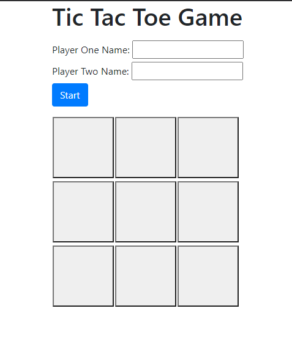

# TicTacToe Game

This is a simple javascript Tic Tac Toe game from the odin project where you can play in your browser.

## Built With

- JavaScript
- Html,
- Css

[Live Demo Link](https://raw.githack.com/Samitti/Tic-Tac-Toe-Project/feature/index.html)

## Authors

👤 **Samuel Teweldebrhan Ghebremeskel**

- Github: [@githubhandle](https://github.com/Samitti)
- Twitter: [@twitterhandle](https://twitter.com/Samuel63734232)
- Linkedin: [linkedin](https://www.linkedin.com/in/samuel-ghebremeskel-29685811a/)

👤 **Mupa M'mbetsa Nzaphila**

- Github: [@mupa1](https://github.com/Mupa1)
- Twitter: [@mupa_mmbetsa](https://twitter.com/mupa_mmbetsa)
- Linkedin: [mupa-mmbetsa](https://www.linkedin.com/in/mupa-mmbetsa)

## 🤝 Contributing

Contributions, issues and feature requests are welcome!

Feel free to check the [issues page](https://github.com/Samitti/Tic-Tac-Toe-Project/issues).

## Show your support

Give a ⭐️ if you like this project!
